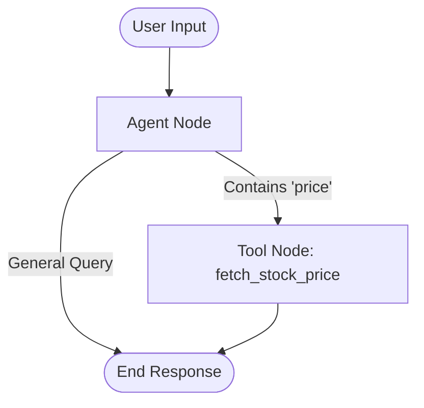

# Agentic Stock Analyzer

A Python-based stock analysis tool leveraging LangGraph, Gemini 1.5 Flash, and yfinance to provide stock information. The project is evolving from a manual logic implementation to a fully autonomous agent.

## Project Structure

```
/
├── main.py          # Core application logic (LangGraph, Gemini, Tools)
├── .env             # Environment variables (API Keys)
├── requirements.txt # Project dependencies
└── README.md        # Project documentation
```

## Features Implemented (Phase 1)

*   **LangGraph Integration:** Set up a stateful graph with `agent` and `tool` nodes.
*   **Gemini 1.5 Flash:** Integrated Google's Generative AI for conversational capabilities.
*   **yfinance Tool:** Implemented a basic `fetch_stock_price` tool to get real-time stock data.
*   **Dynamic User Input:** Interactive CLI loop for continuous user queries.
*   **Environment Management:** Secure API key loading using `python-dotenv`.

## Architecture & Flow

### Current Graph Flow
The current implementation uses a **manual logic** approach for tool routing. The agent node explicitly checks the user string for keywords (e.g., "price") to decide if it should call a tool.



### Manual Logic Components
*   **Routing:** The `agent_node` manually inspects `user_input` for the string "price".
*   **Parameter Extraction:** Tickers (e.g., "AAPL") are extracted using simple string splitting and checking for uppercase words.
*   **Tool Execution:** The `tool_node` executes `fetch_stock_price` based on the manually extracted ticker.

## Roadmap

- [x] **Phase 1: Foundation**
    - [x] Basic LangGraph setup
    - [x] Gemini integration
    - [x] Manual tool routing
    - [x] Interactive CLI

- [ ] **Phase 2: Autonomous Agent**
    - [ ] Replace manual string parsing with LLM Function Calling.
    - [ ] Allow the LLM to decide *which* tool to use (if any).
    - [ ] Enhance parameter extraction (handle "Apple stock" -> "AAPL").

- [ ] **Phase 3: Advanced Analysis**
    - [ ] Add more tools (Technical Indicators, News Sentiment).
    - [ ] Implement multi-step reasoning (e.g., "Compare AAPL and MSFT").

## Setup & Usage

1.  **Install Dependencies:**
    ```bash
    pip install -r requirements.txt
    ```
2.  **Configure Environment:**
    *   Rename `.env.example` (or similar) to `.env`.
    *   Add your API key: `GOOGLE_API_KEY=your_key`.
3.  **Run:**
    ```bash
    python main.py
    ```