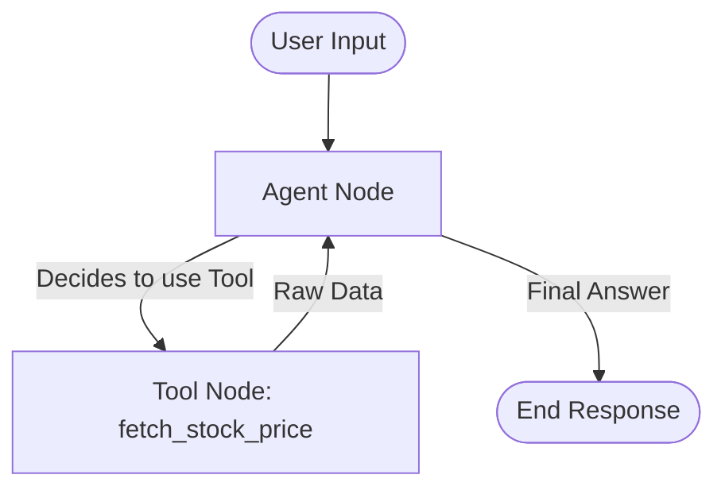

# Agentic Stock Analyzer

A Python-based stock analysis tool leveraging LangGraph, Gemini, and yfinance to provide stock information. The project has evolved from manual logic to a fully autonomous agent using LLM function calling.

## Project Structure

```
/
├── app/                 # Main application package
│   ├── __init__.py
│   ├── agent.py         # Graph definition and "compile()"
│   ├── state.py         # State definition (AgentState)
│   ├── tools.py         # Tool definitions (fetch_stock_price)
├── main.py              # Application entry point
├── .env                 # Environment variables (API Keys)
├── requirements.txt     # Project dependencies
└── README.md            # Project documentation
```

## Features Implemented

### Phase 3: Advanced Analysis (In Progress)
*   **News Search (DuckDuckGo):** integrated `search_web` tool to fetch real-time news and explain "Why" a stock is moving. (Free & Privacy-focused).
*   **Local LLM Support (Ollama):** Added support for running local models (like Llama 3, Mistral) via Ollama for privacy and cost savings. Configurable via `.env`.
*   **Memory (Persistence):** Implemented `MemorySaver` to enable multi-turn conversations and context retention.
*   **Technical Indicators:** Added tools for RSI, SMA, and MACD calculations.
*   **Historical Data:** Enhanced `fetch_stock_price` to retrieve price history over `n` days.
*   **Efficient Caching:** Implemented `lru_cache` to minimize redundant API calls during multi-tool analysis.

### Phase 2: Autonomous Agent (Refactored)
*   **Modular Architecture:** Refactored from a monolithic script to a structured `app/` package, separating State, Tools, and Agent logic.
*   **Standardized ToolNode:** Replaced manual tool execution with `langgraph.prebuilt.ToolNode` for robustness.
*   **LLM Function Calling:** Native tool binding (`bind_tools`) allows Gemini to intelligently invoke `fetch_stock_price`.
*   **Cyclic Graph Flow:** The graph loops (`Tool -> Agent`) enabling natural language interpretation of data.

### Phase 1: Foundation (Completed)
*   **LangGraph Integration:** Set up a stateful graph with `agent` and `tool` nodes.
*   **yfinance Integration:** Real-time stock data fetching.
*   **Interactive CLI:** Continuous user query loop.
*   **Environment Management:** Secure API key loading using `python-dotenv`.

## Architecture & Flow

### Autonomous Flow
The agent now uses a **cyclic** flow where the LLM drives the conversation and tool usage.



### Components
*   **Agent Node:** Receives user input or tool output. Uses `gemini-2.5-flash` to decide the next step (reply or call tool).
*   **Tool Node:** Executes the requested tool (e.g., `fetch_stock_price`) and returns a structured `ToolMessage`.
*   **Conditional Edge:** Inspects the LLM's response for `tool_calls`. If present, routes to the Tool Node; otherwise, ends the turn.

## Roadmap

- [x] **Phase 1: Foundation** (Manual Logic, Basic Graph)
- [x] **Phase 2: Autonomous Agent** (Function Calling, Cyclic Graph)
- [ ] **Phase 3: Advanced Analysis**
    - [ ] Add more tools (Technical Indicators, News Sentiment).
    - [ ] Implement multi-step reasoning (e.g., "Compare AAPL and MSFT").
    - [ ] Add persistence (PostgreSQL/SQLite) to remember conversations.

## Setup & Usage

1.  **Install Dependencies:**
    ```bash
    pip install -r requirements.txt
    ```
2.  **Configure Environment:**
    *   Create a `.env` file.
    *   Add your API key: `GOOGLE_API_KEY=your_key`.
3.  **Run:**
    ```bash
    python main.py
    ```
