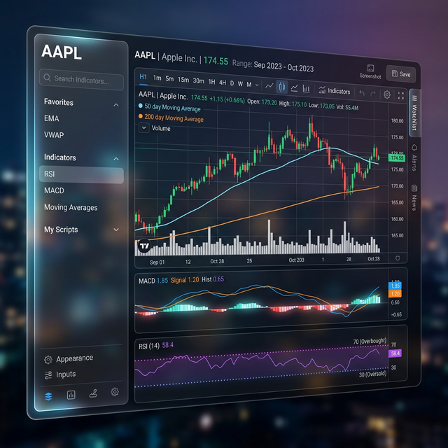
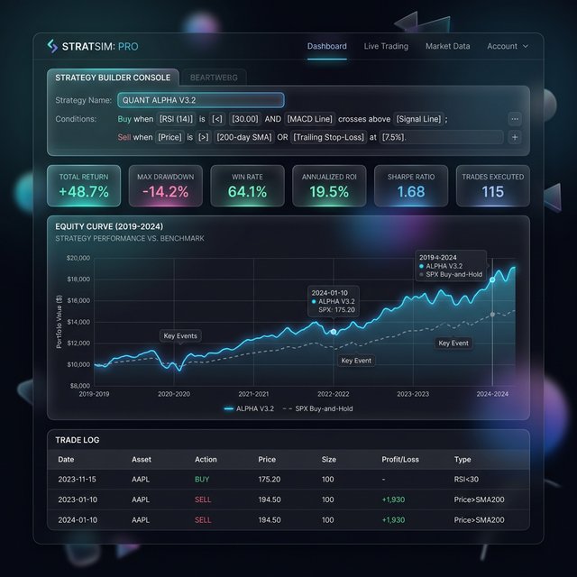

# UI Roadmap: Technical Indicators & Strategy Simulation

This document outlines the focused roadmap for building out robust UI support for technical indicators and strategy simulation, temporarily pausing advanced agentic capabilities to ensure the core visual and analytical tools are best-in-class. 

**Core Constraint:** All implementations must rely strictly on free, open-source tools and libraries (FOSS) to keep the project completely free to run and maintain.

## Phase 1: Interactive Charting Foundation
**Goal:** Upgrade the existing stock chart to support interactive overlays and multiple panes.

- **1.1 Charting Library Upgrade (if necessary):** Evaluate if the current `Recharts` (MIT License) setup can handle complex, multi-pane financial charts with interactive drawing tools. If not, consider migrating to `Lightweight Charts` (Apache 2.0 Open Source by TradingView) for a high-performance, free alternative designed for financial data.
- **1.2 Timeframe Selection:** Implement robust timeframe selectors (1D, 1W, 1M, 3M, 1Y, 5Y, Max) that seamlessly fetch and update candlestick data.
- **1.3 Candlestick vs. Line Toggle:** Allow users to switch between standard line charts and OHLC (Open-High-Low-Close) candlestick charts for deeper price action analysis.

## Phase 2: Core Technical Indicators
**Goal:** Implement the most requested technical indicators natively in the UI with customizable parameters.

- **2.1 Overlays (On-Chart):**
  - **Moving Averages (SMA/EMA):** Allow users to add multiple moving averages, customizing the period (e.g., 20, 50, 200) and color.
  - **Bollinger Bands:** Implement dynamic volatility bands overlaid on the price chart.
- **2.2 Oscillators (Off-Chart Panes):**
  - **Relative Strength Index (RSI):** Add a dedicated pane below the main chart with overbought/oversold threshold lines (typically 70/30).
  - **MACD (Moving Average Convergence Divergence):** Implement the MACD line, signal line, and histogram in a separate pane.
  - **Volume:** Integrate a volume histogram either overlaid at the bottom of the price pane or as a separate pane.
- **2.3 Indicator Management UI:** Build a sleek, glassmorphic modal or side panel to let users easily add, configure (change periods/colors), and remove indicators.

## Phase 3: Strategy Simulation & Backtesting Interface
**Goal:** Provide a UI for users to define basic trading rules and visualize historical performance.

- **3.1 Strategy Builder Console:** Create a dedicated view where users can string together conditions based on the available indicators.
  - *Example:* "Buy when RSI < 30" AND "Price > 200 SMA".
- **3.2 Historical Backtest Runner:** A UI component that triggers a backend simulation over a selected timeframe. The backend must use open-source backtesting engines like `backtrader` (GPL) or custom pandas-based vectorization using `pandas_ta` (MIT).
- **3.3 Performance Dashboard:** Visualize the results of the backtest.
  - **Metrics:** Display Total Return, Max Drawdown, Win Rate, and Sharpe Ratio.
  - **Equity Curve:** Plot the strategy's portfolio value over time compared to a "Buy and Hold" benchmark.
  - **Trade Log:** A datatable showing individual entry and exit points.
- **3.4 Visual Trade Markers:** Overlay "Buy" and "Sell" signals directly onto the main price chart based on the strategy's historical execution.

## Phase 4: Integration with AI Agents (Future)
**Goal:** Seamlessly blend these manual UI tools with the LangGraph agents.

- **4.1 Generative Strategies:** Allow users to ask the AI (e.g., "Build a mean-reversion strategy for TSLA") and have the UI automatically populate the Strategy Builder and run the backtest.
- **4.2 AI Indicator Explanation:** Hover over an active indicator (like RSI) and have a localized agent explain what it currently signifies for the specific stock.
